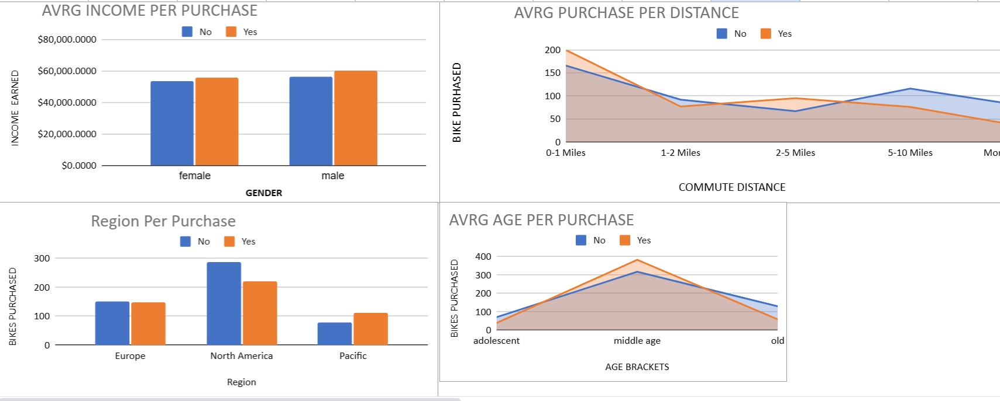

# Bike Purchase Data Analysis with Excel: Dashboard and Pivot Table Visualization

## Project Overview
This project aims to analyze bike purchase data using Microsoft Excel. By creating a pivot table dashboard, we explore various aspects of bike purchases to uncover insights and trends in customer behavior.

## Dashboard Image

*Note: Insert your dashboard image here. You can directly embed the image in the README or provide a link to it.*

## Data Sources
The bike purchase data used in this analysis was obtained from [https://www.youtube.com/redirect?event=video_
description&redir_token=QUFFLUhqblVsSmliQ0tTSUthWVotZTlEU2ZyNkNPd3dMd3xBQ3Jtc0trQ0xzdTJYb2JlQkpUaU1NX1F0OVhnYl
hYRkVwUVNFVXFHZ0w0UGpxUW9DYWNfcVV3YkJ4LThwX3duT2pjTWdlNFIzX1pYX1RNczJRSElzeG1kM0FTcDZVWDk0MzNKcElXV3E4YURxcFp3S
Ho4WXRaWQ&q=https%3A%2F%2Fgithub.com%2FAlexTheAnalyst%2FExcel-Tutorial%2Fblob%2Fmain%2FExcel%2520Project%2520Da
taset.xlsx&v=opJgMj1IUrc]. The dataset includes information on customer demographics, purchase history, and product preferences.

## Tools Used
- Microsoft Excel: Used for data analysis, visualization, and creating pivot table dashboards.

## Analysis Process
1. Imported the bike purchase dataset into Excel.
2. Cleaned and formatted the data for analysis.
3. Created pivot tables to summarize and analyze key metrics such as total sales, customer demographics.
4. Designed a dashboard layout to visualize pivot table results for easy interpretation.

## Key Findings
- **Total Sales:** Total revenue generated from bike purchases.
- **Customer Demographics:** Distribution of purchases by age, gender, and location.
